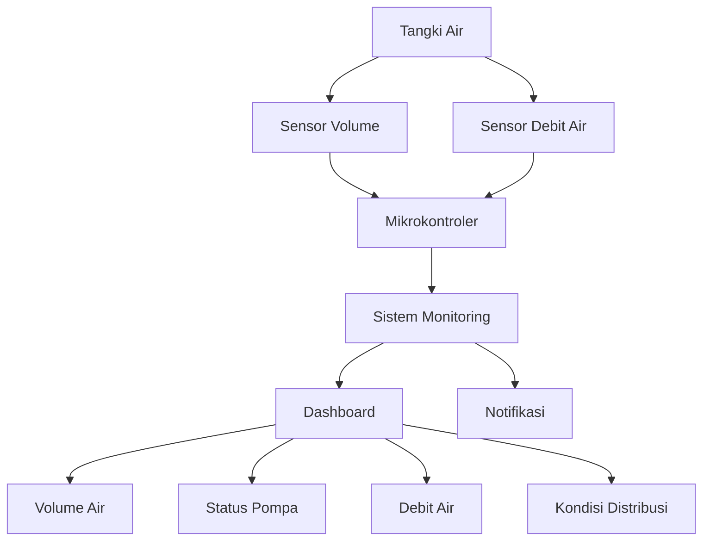

# LAPORAN KUESIONER PEMILIK USAHA KANTIN FEB

## Analisis Permasalahan Operasional sebagai Dasar Perancangan Solusi Teknologi Informasi

**Universitas Pancasila**  
**Fakultas Teknik**  
**Program Studi Teknik Informatika**  
**Tahun 2026**

---

## Anggota Kelompok

1. **4523210019 Anggun Setiawati Dewi**
2. **4524210089 Ridwan Odi Nugroho**
3. **4525210010 Alwan Fawwaz Ibrahim**
4. **4524210105 Zaidan Dziaulfawwaz**
5. **4525210003 Adystya Anandita**

---

# Cakupan dalam Laporan

| Sub-CPMK | Cakupan dalam Laporan |
|----|----|
| **Sub-CPMK 1** | Identifikasi kondisi dan karakteristik usaha berdasarkan hasil kuesioner. |
| **Sub-CPMK 2** | Pengumpulan informasi mengenai produk, pelanggan, proses penjualan, dan kegiatan operasional usaha. |
| **Sub-CPMK 3** | Identifikasi permasalahan yang dihadapi pemilik usaha, khususnya permasalahan ketersediaan dan distribusi air. |
| **Sub-CPMK 4** | Analisis kebutuhan berdasarkan permasalahan yang ditemukan dari hasil kuesioner. |
| **Sub-CPMK 5** | Perumusan kemungkinan solusi berbasis Teknologi Informasi. |
| **Sub-CPMK 7** | Penyusunan rekomendasi pengembangan sistem monitoring menggunakan sensor, mikrokontroler, database, dan dashboard. |
| **Sub-CPMK 8** | Dokumentasi dan penyajian hasil kuesioner dalam bentuk laporan dan dokumentasi GitHub. |
| **Sub-CPMK 9** | Refleksi terhadap peran mahasiswa Teknik Informatika dalam mengidentifikasi permasalahan nyata dan merancang solusi berbasis teknologi. |

> **Catatan:** Pemetaan Sub-CPMK di atas perlu disesuaikan kembali dengan definisi Sub-CPMK pada RPS atau instruksi resmi dosen apabila terdapat ketentuan khusus.

---

# 1. Pendahuluan

Kuesioner ini dilakukan untuk mengetahui kondisi usaha dan permasalahan yang dihadapi oleh pemilik usaha kantin dan usaha pendukung di lingkungan Fakultas Ekonomi dan Bisnis Universitas Pancasila.

Kegiatan ini dilakukan oleh mahasiswa Program Studi Teknik Informatika, Fakultas Teknik, Universitas Pancasila. Oleh karena itu, hasil kuesioner tidak hanya digunakan untuk mengetahui kondisi usaha, tetapi juga untuk mengidentifikasi permasalahan yang dapat dikembangkan menjadi solusi berbasis Teknologi Informasi.

Berdasarkan hasil kuesioner dari beberapa pemilik usaha, sebagian besar kegiatan operasional seperti penjualan, pengelolaan stok, dan penggunaan kemasan dapat berjalan dengan baik.

Namun, ditemukan beberapa permasalahan pada beberapa usaha, seperti ketersediaan air keran yang tidak mencukupi, debit air yang kecil, air keran yang terkadang habis, kenaikan harga bahan baku, kenaikan harga plastik, serta gangguan listrik pada usaha fotocopy.

Dari berbagai permasalahan tersebut, ketersediaan dan distribusi air menjadi salah satu permasalahan yang ditemukan pada beberapa kantin dan dapat dianalisis lebih lanjut dari sudut pandang Teknik Informatika.

---

# 2. Tujuan

Kuesioner ini memiliki beberapa tujuan, yaitu:

1. Mengetahui jenis usaha dan produk yang dijual oleh pemilik usaha.
2. Mengetahui pelanggan utama dari masing-masing usaha.
3. Mengetahui proses penjualan dan pelayanan kepada pelanggan.
4. Mengetahui cara pemilik usaha mengelola stok barang dan bahan baku.
5. Mengidentifikasi kendala yang terjadi dalam kegiatan operasional.
6. Mengidentifikasi permasalahan fasilitas yang digunakan oleh usaha.
7. Menganalisis permasalahan yang dapat dikembangkan menjadi kebutuhan sistem berbasis Teknologi Informasi.
8. Memberikan rekomendasi awal berupa kemungkinan solusi teknologi terhadap permasalahan yang ditemukan.

---

# 3. Hasil Kuesioner

Berdasarkan hasil kuesioner terhadap beberapa pemilik usaha, diperoleh informasi mengenai kondisi dan permasalahan yang dialami oleh masing-masing usaha.

| Usaha | Lama Usaha | Pelanggan Utama | Permasalahan yang Ditemukan |
|---|---|---|---|
| **Kantin Risol Sovina** | Tidak disebutkan | Mahasiswa | Kekurangan air keran untuk mencuci piring dan keperluan lainnya |
| **Warung Makan Berkah** | ± 5 tahun | Mahasiswa, dosen, dan karyawan | Air keran kurang atau debit air kecil |
| **Fotocopy Mitra Buana** | Sejak 2009 | Mahasiswa dan dosen | Listrik dapat mati hingga beberapa jam |
| **Mie RR** | ± 2 tahun | Mahasiswa | Air keran sering habis dan distribusi air tidak merata |
| **Dapur Selera Mamah Ria** | ± 6 bulan | Mahasiswa, dosen, dan karyawan | Air keran kecil dan kenaikan harga bahan baku |

Secara umum, proses penjualan pada usaha-usaha tersebut dapat berjalan dengan baik. Permasalahan yang paling sering muncul berkaitan dengan fasilitas pendukung, terutama ketersediaan air keran.

---

# 4. Analisis Permasalahan Air

Berdasarkan jawaban pemilik usaha, permasalahan air yang ditemukan meliputi:

- Air keran terkadang habis.
- Debit air yang keluar kecil.
- Air kurang mencukupi untuk mencuci piring dan peralatan.
- Beberapa kantin menggunakan sumber air yang sama.
- Ketika beberapa kantin menggunakan air secara bersamaan, debit air dapat menjadi lebih kecil.
- Terdapat kemungkinan bahwa kapasitas pompa dan sistem distribusi belum mampu memenuhi kebutuhan seluruh kantin secara bersamaan.

Permasalahan tersebut penting karena air digunakan untuk kegiatan operasional sehari-hari, seperti:

- Mencuci piring.
- Mencuci peralatan memasak.
- Membersihkan area kantin.
- Menjaga kebersihan peralatan makan.
- Mendukung kegiatan operasional kantin.

Apabila debit air terlalu kecil, kegiatan mencuci dan membersihkan peralatan dapat menjadi lebih lambat dan mengganggu kegiatan operasional.

---

# 5. Kemungkinan Penyebab Permasalahan

Berdasarkan hasil kuesioner, penyebab sebenarnya masih perlu diperiksa secara langsung. Namun, terdapat beberapa kemungkinan penyebab yang dapat dijadikan dasar untuk analisis lebih lanjut.

## 5.1 Kapasitas Tangki Air Tidak Mencukupi

Salah satu kemungkinan adalah kapasitas penampungan air yang tersedia belum mencukupi kebutuhan seluruh kantin.

Jika banyak kantin menggunakan air secara bersamaan, persediaan air di dalam tangki dapat berkurang lebih cepat.

Salah satu solusi fasilitas yang dapat dipertimbangkan adalah:

> **Menambahkan satu tangki air sebagai penampungan tambahan atau cadangan.**

Dengan adanya tangki tambahan, jumlah air yang dapat disimpan menjadi lebih besar sehingga dapat membantu memenuhi kebutuhan pada saat penggunaan air meningkat.

## 5.2 Kapasitas Pompa Air

Kemungkinan kedua adalah kapasitas pompa belum sesuai dengan jumlah kantin yang menggunakan air.

Apabila banyak kantin menggunakan air secara bersamaan, tekanan dan debit air yang diterima oleh setiap kantin dapat mengalami penurunan.

## 5.3 Distribusi Air Tidak Memadai

Kemungkinan lainnya adalah sistem distribusi air belum dapat memberikan debit yang merata kepada seluruh kantin.

Berdasarkan keterangan pemilik usaha, terdapat kondisi ketika beberapa kantin menggunakan air secara bersamaan dan kantin lain mendapatkan air dengan debit yang lebih kecil atau bahkan tidak mendapatkan air.

Terdapat keterangan dari salah satu pemilik usaha bahwa apabila beberapa kantin menggunakan air secara bersamaan, debit air pada kantin lain dapat menjadi lebih kecil atau bahkan tidak keluar.

Kondisi tersebut masih merupakan keterangan berdasarkan pengalaman pemilik usaha dan belum dibuktikan melalui pengukuran teknis secara langsung.

---

# 6. Potensi Solusi Berbasis Teknologi Informasi

Sebagai mahasiswa Teknik Informatika, permasalahan tersebut dapat dikembangkan menjadi sebuah konsep **Sistem Monitoring Ketersediaan dan Distribusi Air Kantin**.

Sistem ini bertujuan untuk membantu pengelola mengetahui kondisi air secara lebih mudah dan terukur.

Sistem dapat memantau beberapa informasi, seperti:

- Volume air di dalam tangki.
- Status pompa.
- Debit air.
- Kondisi distribusi air.
- Waktu penggunaan air.
- Peringatan ketika volume air rendah.

Dengan adanya sistem monitoring, kondisi air tidak hanya diketahui berdasarkan perkiraan atau pemeriksaan manual, tetapi dapat dipantau berdasarkan data dari sensor.

---

## 6.1 Rancangan Awal Sistem

Berikut merupakan gambaran konsep awal sistem monitoring:



### Informasi yang Dapat Dipantau

**Dashboard:**

- Volume air
- Status pompa
- Debit air
- Kondisi distribusi

**Notifikasi:**

- Volume air rendah
- Debit air mengalami penurunan
- Kondisi distribusi mengalami gangguan

> Diagram di atas merupakan **rancangan konsep awal**, bukan sistem yang sudah diimplementasikan.

---

# 7. Hubungan dengan Teknik Informatika

Konsep sistem monitoring tersebut dapat dikembangkan menggunakan beberapa teknologi yang berkaitan dengan Teknik Informatika.

## 7.1 Internet of Things (IoT)

Sensor dapat digunakan untuk membaca kondisi air secara langsung.

Contohnya adalah sensor yang digunakan untuk mengetahui ketinggian atau volume air di dalam tangki.

## 7.2 Mikrokontroler

Mikrokontroler dapat digunakan sebagai penghubung antara sensor dengan sistem.

Mikrokontroler menerima data dari sensor kemudian mengirimkan data tersebut ke sistem monitoring.

## 7.3 Database

Data yang diperoleh dapat disimpan ke dalam database.

Contoh data yang dapat disimpan:

- Volume air.
- Debit air.
- Waktu pengukuran.
- Status pompa.
- Kondisi distribusi.

Data tersebut kemudian dapat digunakan untuk melihat riwayat penggunaan air.

## 7.4 Dashboard

Data dapat ditampilkan melalui dashboard agar pengelola dapat melihat kondisi air dengan lebih mudah.

Contohnya:

```text
Volume Air      : 65%
Status Pompa    : Aktif
Debit Air       : Normal
Distribusi      : Normal
```

## 7.5 Sistem Notifikasi

Sistem juga dapat memberikan peringatan ketika kondisi tertentu terjadi.

Contohnya:

```text
PERINGATAN:
Volume air tangki rendah.
```

atau:

```text
PERINGATAN:
Debit air mengalami penurunan.
```

---

# 8. Rekomendasi Awal

Sebelum langsung membuat sistem, diperlukan pengumpulan data dan pemeriksaan kondisi fasilitas air.

Data yang sebaiknya dikumpulkan adalah:

| Data | Tujuan |
|---|---|
| Kapasitas tangki | Mengetahui jumlah air maksimum yang dapat ditampung |
| Volume air | Mengetahui jumlah air yang tersedia |
| Debit air | Mengetahui jumlah air yang keluar |
| Tekanan air | Mengetahui kondisi distribusi |
| Kapasitas pompa | Mengetahui kemampuan pompa |
| Jumlah kantin | Mengetahui jumlah pengguna air |
| Waktu penggunaan | Mengetahui waktu penggunaan air tertinggi |
| Jumlah pengguna secara bersamaan | Mengetahui pengaruh penggunaan bersama terhadap debit |
| Jalur perpipaan | Mengetahui sistem distribusi air |

Setelah data tersebut diperoleh, dapat dilakukan analisis untuk mengetahui apakah masalah utama berasal dari:

**Tangki → Pompa → Pipa/Distribusi → atau jumlah penggunaan air secara bersamaan.**

Jika kapasitas penampungan memang tidak mencukupi, maka **penambahan satu tangki air** dapat dipertimbangkan.

Jika masalah terdapat pada distribusi, maka sistem perpipaan dan tekanan air perlu diperiksa.

Jika masalah terdapat pada pemantauan, maka sistem monitoring berbasis IoT dapat dikembangkan.

---

# 9. Kesimpulan

Berdasarkan hasil kuesioner, kegiatan operasional sebagian besar usaha kantin dan usaha pendukung di lingkungan Fakultas Ekonomi dan Bisnis Universitas Pancasila dapat berjalan dengan baik. Namun, terdapat beberapa kendala seperti gangguan listrik, kenaikan harga bahan baku, harga plastik, serta permasalahan ketersediaan air.

Permasalahan air menjadi salah satu permasalahan yang ditemukan pada beberapa kantin. Permasalahan tersebut meliputi **air keran yang kecil, air yang terkadang habis, serta air yang kurang mencukupi untuk mencuci piring dan peralatan kantin**.

Berdasarkan keterangan pemilik usaha, terdapat kemungkinan bahwa permasalahan tersebut berkaitan dengan **kapasitas penampungan air, kemampuan pompa, atau sistem distribusi air yang belum memadai**. Penggunaan air secara bersamaan oleh beberapa kantin juga dilaporkan dapat menyebabkan debit air pada kantin lain menjadi lebih kecil atau bahkan tidak keluar. Kondisi tersebut masih perlu dibuktikan melalui pengukuran langsung terhadap sistem distribusi air.

Salah satu solusi fasilitas yang dapat dipertimbangkan adalah **penambahan satu tangki air sebagai penampungan tambahan**. Namun, sebelum menentukan solusi akhir, diperlukan pemeriksaan dan pengukuran terhadap kapasitas tangki, pompa, debit air, tekanan, serta sistem perpipaan.

Dari sudut pandang **Teknik Informatika**, permasalahan tersebut memiliki potensi untuk dikembangkan menjadi **Sistem Monitoring Ketersediaan dan Distribusi Air Berbasis IoT**. Sistem dapat menggunakan sensor dan mikrokontroler untuk memperoleh data mengenai volume air, status pompa, debit air, dan kondisi distribusi. Data tersebut kemudian dapat ditampilkan melalui dashboard serta digunakan untuk memberikan notifikasi apabila terjadi kondisi tertentu.

Dengan demikian, hasil kuesioner dapat menjadi dasar untuk mengidentifikasi permasalahan nyata di lingkungan kampus dan merancang kemungkinan solusi berbasis Teknologi Informasi yang dapat membantu proses pemantauan kondisi air secara lebih terukur.

---

# Dokumentasi Kuesioner

## Kantin/Usaha yang Menjadi Sumber Informasi

1. Kantin Risol Sovina
2. Warung Makan Berkah
3. Fotocopy Mitra Buana
4. Mie RR
5. Dapur Selera Mamah Ria

---

# Pembagian Anggota Kelompok

| No. | NPM | Nama |
|---:|---|---|
| 1 | 4523210019 | Anggun Setiawati Dewi |
| 2 | 4524210089 | Ridwan Odi Nugroho |
| 3 | 4525210010 | Alwan Fawwaz Ibrahim |
| 4 | 4524210105 | Zaidan Dziaulfawwaz |
| 5 | 4525210003 | Adystya Anandita |

---

## Catatan

Laporan ini disusun berdasarkan jawaban yang diberikan oleh pemilik usaha melalui kuesioner.

Analisis mengenai kemungkinan keterbatasan kapasitas tangki, kapasitas pompa, dan distribusi air merupakan **analisis awal berdasarkan keluhan yang disampaikan oleh pemilik usaha**. Penyebab teknis sebenarnya masih memerlukan pemeriksaan dan pengukuran secara langsung.

Rancangan sistem monitoring berbasis IoT yang ditampilkan dalam laporan merupakan **konsep atau rekomendasi awal**, bukan sistem yang telah diimplementasikan.
